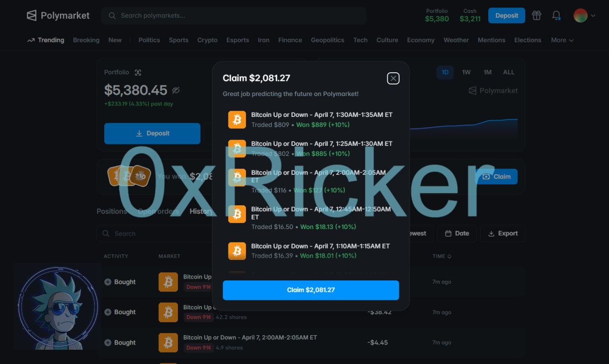
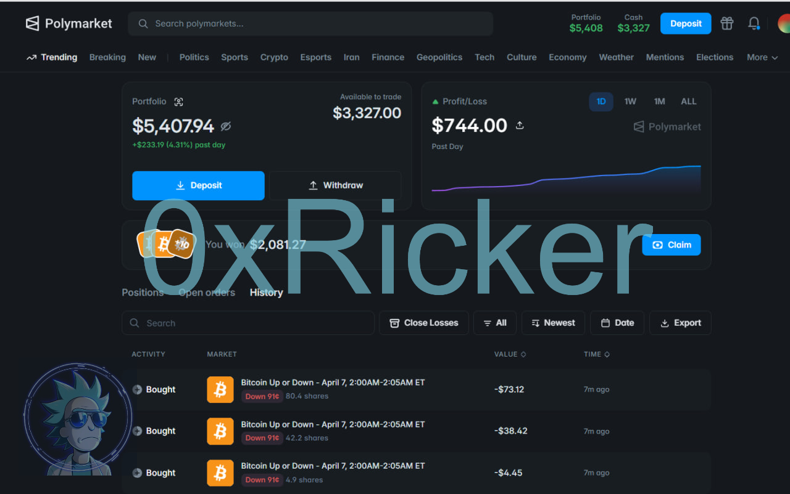
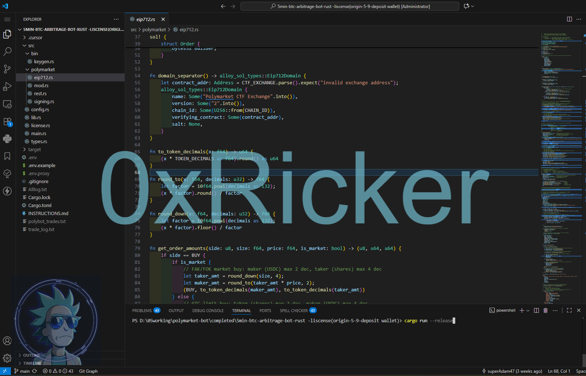

# Polymarket 交易机器人套件 — BTC 套利与 AI Agent

[English](README.md) | **中文（简体）** | [Русский](README.ru.md)

---

## 产品概述

本仓库提供一套 **精心筛选的 Polymarket 交易系统**，面向重视 **执行速度**、**市场优势** 与 **稳定自动化** 的专业交易者：

- **套利导向策略** — 在可行范围内采用市场中性执行框架
- **AI Agent 交易** — 自动市场分析、决策支持与订单执行
- **低延迟基础设施** — 基于 Rust 构建，适用于时间敏感型交易窗口

**联系、授权与高级支持**

如需 **完整源码**、扩展功能、VPS 部署协助、定制策略开发或高级版本，请通过 Telegram 联系：**[@x_Ricker](https://t.me/x_Ricker)**。

**推荐计划：** 成功推荐购买完整版或高级版，可选择 **30% 佣金** 或 **免费机器人使用权**。

---

## 为什么我们先展示交易证明

**用户安全是第一位的。** 这也是本仓库只发布截图与交易证明、不提供可下载代码的主要原因。

市面上有不少公开的机器人仓库看起来可以直接运行，但里面的内容未必如表面所见。未经充分了解就运行代码、尤其是连接了实盘钱包时，结果往往并不理想。只展示证明而非代码，是为了让您在**不暴露钱包风险**的情况下先评估成果。

**推荐流程：**

1. **查看** — 按自己的节奏浏览本仓库的截图与交易证明。
2. **沟通** — 通过 Telegram 联系我们，有任何问题都可以聊。我们很乐意为您讲解每个机器人的运作方式。
3. **决定** — 在充分查看并与开发者沟通后，若您觉得合适，再放心购买完整版本。

这里没有供随意克隆运行的程序。完整源码、高级版本及一对一部署支持，**仅在您审阅证明并与我们直接沟通之后**提供——因为我们希望您在做出决定前，清楚知道自己购买的是什么。

---

## 包含的机器人

> 本仓库仅提供 **交易证明与预览**。完整代码与配置文档在直接联系后提供。

### 1) Polymarket 5 分钟 / 15 分钟 BTC 套利机器人（Rust）

- **代码仓库**：[`PolyMaxi/polymarket-5min-15min-1hr-btc-arbitrage-trading-bot-rust`](https://github.com/PolyMaxi/polymarket-5min-15min-1hr-btc-arbitrage-trading-bot-rust)
- **适用场景**：对 **低延迟执行** 有较高要求的短周期交易者
- **功能概述**：针对 BTC Up/Down 短周期窗口提供高速下单能力，支持 dry-run 与实盘模式
- **高级版本**（1 小时、XRP、SOL、ETH）：请通过 Telegram 联系 **[@x_Ricker](https://t.me/x_Ricker)**

---

### 2) Polymarket AI Agent 交易机器人

- **代码仓库**：[`PolyMaxi/polymarket-ai-agent-trading-bot`](https://github.com/PolyMaxi/polymarket-ai-agent-trading-bot)
- **适用场景**：需要 **AI 辅助分析** 与 Polymarket 自动执行的交易者
- **功能概述**：智能 Agent 持续监控市场，评估价格与流量，生成交易建议，并在可配置的风控与日志框架下自动执行
- **定制模型、提示词或策略逻辑**：请联系 **[@x_Ricker](https://t.me/x_Ricker)**

---

## 授权、定制与高级支持

本套件提供 **演示版本与策略预览**。常见升级需求包括：

- 完整源码与私有模块
- 增强执行路径与滑点控制
- 更多币种、时间窗口与交易场所
- VPS 部署、系统监控与 Telegram 告警
- 定制策略规则与风险管理框架

### 推荐计划

成功推荐购买完整版或高级版，可选择 **30% 佣金** 或 **免费机器人使用权**。

如有咨询，请通过 Telegram 联系：**[@x_Ricker](https://t.me/x_Ricker)**。

---

## 免责声明

本工具仅供学习与研究使用。交易存在重大亏损风险。您需自行承担系统配置、合规要求及全部交易结果的责任。
